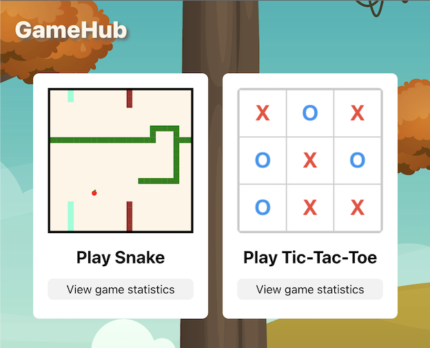

# GameHub
The project is a website that showcases two classic online games, Snake and Tic Tac Toe.  
It uses Java Spring Boot as the backend, React as the frontend, and PostgreSQL as the database.



## Local Development

### Prerequisites

* Java 17 or later.  
* Node.js 16.15.1 or later.  
* Postgres 15.2 or later.  

The project might run with earlier versions but it is not guaranteed.

### Installation

1. Clone this repository to your local machine  
    ```sh
    git clone https://github.com/ozhey/GameHub.git
    ```
2. Set up the database:  
    * Create a new PostgreSQL database  
      ```sh
      docker run
        --name gamehub
        -p 5433:5432 
        -e POSTGRES_USER=admin 
        -e POSTGRES_PASSWORD=admin 
        -e POSTGRES_DB=gamehub
        -d postgres
      ```
    * In case you chose to create the database in a different way, you might need to update the database credentials in the application.properties file under src/main/resources.  
3. Start the backend server:  
    * Navigate to the backend directory and run `mvn clean package`. This will compile your code and create a JAR file containing your Spring application and its dependencies in the target directory.
    * Run the JAR file using the java command  
      ```sh
      java -jar ./target/JPA-0.0.1-SNAPSHOT.jar
      ```  
    The name of the created JAR file might be different on your machine.
4. Start the frontend server:
    * Navigate to the frontend directory.
    * Install dependencies: `npm install`.
    * Start the server: `npm start`.
5. Open the website:
    * Open a web browser and go to http://localhost:3000.

